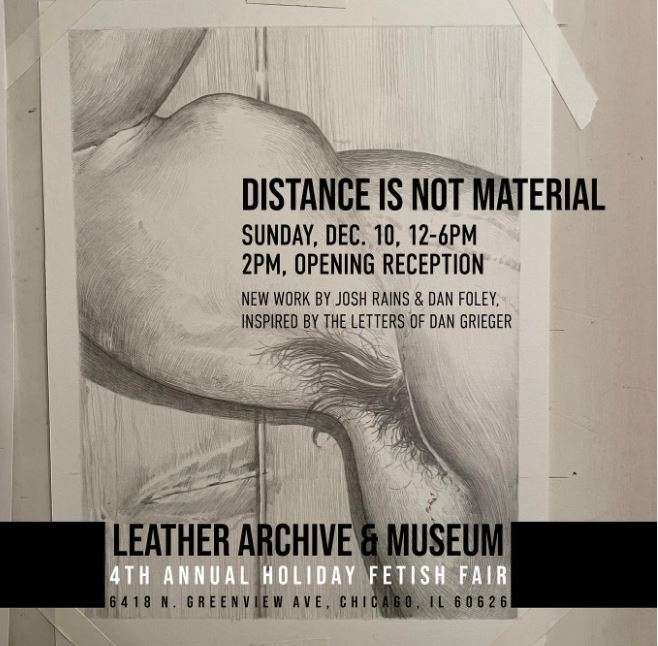
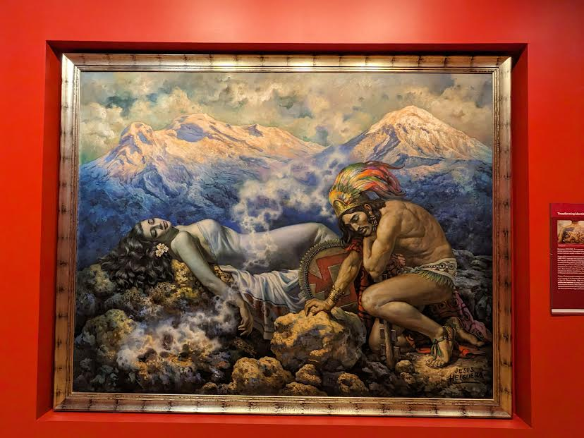

## Museum Archive Response
I have visited two museums over the last 3 months. I have visited the Leather and Archives Museum and the National Musuem of Mexican Art down in Pilsen.

## Leather and Archives Museum
Mission Statement 
"Making leather, kink, BDSM, and fetish accessible through research, preservation, education and community engagement".

## Response
This museum archives and exhibits behaviors, practices and artitfacts that are considered "kink" These kinks subvert and dismantle the rigid structure of sexuality and encourage exploration of sexual behavior. This museum would be considered more a curiosity. This niche group is tied to a subculture that can accomadate any race, gender etc. 

## Mexican Museum of Art

Mission statement

"To stimulate knowledge and appreciation of Mexican art and culture from both sides of the border through a significant permanent collection of Mexican art, rich visual and performing arts programs, high quality arts education programs and resources and professional development of Mexican artists. The Museum welcomes all people and strives to foster a world where all are included."

## Response

I think this museum is is more of museum display. This museum is curated and by Mexican/Mexican American artists to document and uphold their traditions and values. The culture of these people are very unique and prohibits outside groups from infiltrating this space. The status, culture and heritage are interwoven into the space and the curated pieces on display.
